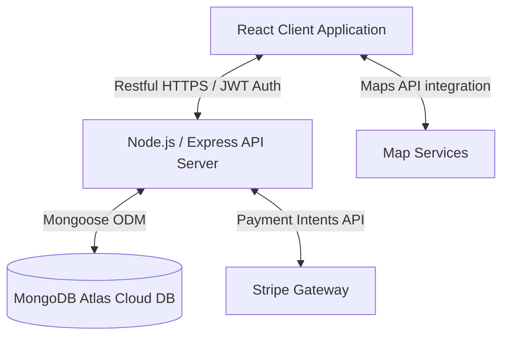

# ParkItNow 🚗💨

[](https://react.dev/)
[](https://vitejs.dev/)
[](https://tailwindcss.com/)
[](https://nodejs.org/)
[](https://expressjs.com/)
[](https://www.mongodb.com/atlas)
[](https://jwt.io/)
[](LICENSE)

> **ParkItNow** is a Next-Generation Smart Parking Reservation Platform. Effortlessly find, reserve, and pay for parking spots in real-time. Designed to optimize urban mobility and streamline parking management.

---

## 📖 Table of Contents

- [Introduction](#-introduction)
- [Key Features](#-key-features)
- [Architecture Overview](#-architecture-overview)
- [Folder Structure](#-folder-structure)
- [Environment Variables](#%EF%B8%8F-environment-variables)
- [Installation Steps](#-installation-steps)
- [Running Locally](#-running-locally)
- [Future Enhancements](#-future-enhancements)
- [Contributing](#-contributing)
- [License](#-license)

---

## 🌟 Introduction

Finding parking in congested urban centers can be a source of stress, traffic, and carbon emissions. **ParkItNow** is a full-stack MERN application that connects drivers searching for immediate or scheduled parking with spot owners who want to monetize their idle spaces. Using modern geospatial queries, interactive mapping, dynamic pricing, and secure payment processing, the platform bridges the gap between drivers and parking availability.

---

## ⚡ Key Features

### 🚙 For Drivers
- **Interactive Map Search**: Discover nearby available parking spaces in real-time, filtered by price, proximity, and features (e.g., EV Charging, Covered, Security Cameras).
- **Instant & Scheduled Reservations**: Book a parking spot immediately or reserve one in advance for specific date/time windows.
- **Secure Stripe Checkout**: Seamlessly pay for bookings online with major credit cards using Stripe API integration.
- **Dynamic Booking Status**: Monitor upcoming, active, completed, or cancelled reservations from a clean dashboard.

### 🅿️ For Spot Owners (Hosts)
- **Spot Listing Portal**: Effortlessly list parking spots by providing location, pricing, photographs, and available amenities.
- **Smart Analytics Dashboard**: Track reservation histories, occupancy rates, and real-time earnings charts.
- **Availability Schedule Controls**: Block off hours or adjust base pricing dynamically based on demand.

### 🔐 System-Wide
- **Role-Based Authentication**: Secure registration and login using JWT (JSON Web Tokens) with distinct roles for Drivers, Spot Owners, and Platform Administrators.
- **Geospatial Querying**: Utilizes MongoDB's geospatial indexes to query database spots using longitude and latitude distance matrices.

---

## 🏗️ Architecture Overview

The application is structured as a decoupled monorepo using **NPM Workspaces**:



- **Frontend SPA**: React bundled with Vite for near-instant hot module replacement, styled dynamically with Tailwind CSS.
- **Backend API**: Express router implementing clean MVC design, robust authentication middleware, and input sanitization layers.
- **Database Layer**: MongoDB Atlas hosting schemas structured via Mongoose ODM, utilizing spatial indexes (`2dsphere`) to support distance-based lookups.

---

## 📂 Folder Structure

```
ParkItNow/
├── client/                 # React Client Application (Vite-powered SPA)
│   ├── public/             # Static public assets
│   └── src/                # Frontend source code
│       ├── assets/         # Images, illustrations, and SVG icons
│       ├── components/     # Reusable layout and interface components
│       ├── context/        # Global React Contexts (AuthContext, SpotContext)
│       ├── hooks/          # Custom reusable React hooks
│       ├── pages/          # Full page views (Home, Dashboard, Search)
│       ├── services/       # API call handlers & payment wrappers (Axios, Stripe)
│       ├── styles/         # Global styles (Tailwind imports and custom transitions)
│       └── utils/          # Formatting functions and client constants
│
├── server/                 # Express API Server (Node.js backend)
│   └── src/                # Backend source code
│       ├── config/         # Database, Environment, and external client setups
│       ├── controllers/    # API endpoint request & response controller logic
│       ├── middleware/     # Custom Express middlewares (JWT check, error handling)
│       ├── models/         # Mongoose Schemas (User, ParkingSpot, Reservation)
│       ├── routes/         # Express routing directories mapping APIs
│       └── utils/          # Shared utility libraries and custom errors
│
└── docs/                   # Developer documentation & planning guides
    ├── architecture.md     # In-depth architectural designs
    ├── implementation_plan.md # Developmental phases and installation requirements
    └── task.md             # Living tasks checklist
```

---

## ⚙️ Environment Variables

Before launching the project, configure your environment variables. A sample layout is provided in **[.env.sample](.env.sample)**. 

### Server Configuration (`server/`)
Create a `.env` file inside the `server/` directory:
```env
PORT=5000
NODE_ENV=development
MONGODB_URI=mongodb+srv://<username>:<password>@cluster.mongodb.net/parkitnow
JWT_SECRET=your_jwt_secret_token
JWT_EXPIRE=7d
STRIPE_SECRET_KEY=sk_test_...
STRIPE_WEBHOOK_SECRET=whsec_...
MAPS_API_KEY=your_maps_key
CLIENT_URL=http://localhost:5173
```

### Client Configuration (`client/`)
Create a `.env` file inside the `client/` directory:
```env
VITE_API_BASE_URL=http://localhost:5000/api/v1
VITE_MAPS_PUBLIC_TOKEN=pk.your_maps_token
VITE_STRIPE_PUBLISHABLE_KEY=pk_test_...
```

---

## 🛠️ Installation Steps

### 1. Clone the Repository
```bash
git clone https://github.com/yourusername/ParkItNow.git
cd ParkItNow
```

### 2. Configure Environments
Copy the sample environment files for both workspace applications as shown in the [Environment Variables](#%EF%B8%8F-environment-variables) section.

### 3. Install Workspace Dependencies
Run the command below from the project root to automatically resolve and install all node packages across workspaces:
```bash
npm install
```

---

## 💻 Running Locally

Start the client React application and backend Express API simultaneously using the concurrent workspace engine:

```bash
npm run dev
```

- **Frontend Client**: Runs on [http://localhost:5173](http://localhost:5173)
- **Backend Server API**: Runs on [http://localhost:5000](http://localhost:5000)

---

## 🚀 Future Enhancements

- **Smart IoT Sensors**: Integration with IoT parking sensor APIs to reflect true physical spot state changes instantaneously.
- **License Plate Recognition (LPR)**: Automotive entry/exit logs tracking.
- **P2P Parking Spot Leasing**: Rent private driveways dynamically using smart-lock credentials.
- **Predictive AI Pricing**: Price recommendations for spot owners matching peak congestion patterns in urban regions.

---

## 🤝 Contributing

Contributions are what make the open-source community such an amazing place to learn, inspire, and create. Any contributions you make are **greatly appreciated**.

1. Fork the Project
2. Create your Feature Branch (`git checkout -b feature/AmazingFeature`)
3. Commit your Changes (`git commit -m 'Add some AmazingFeature'`)
4. Push to the Branch (`git push origin feature/AmazingFeature`)
5. Open a Pull Request

---

## 📄 License

Distributed under the MIT License. See [LICENSE](LICENSE) for more details.
