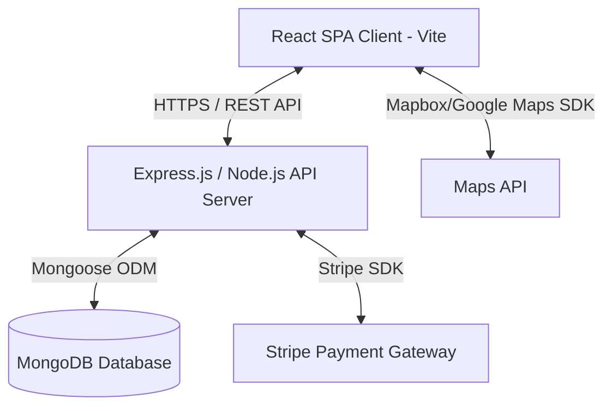

# Architecture Design - ParkItNow Smart Parking Reservation Platform

## 1. System Overview

**ParkItNow** is a Smart Parking Reservation Platform built on the MERN (MongoDB, Express.js, React, Node.js) stack. It is designed to help drivers locate, reserve, and pay for parking spots in real-time, while allowing parking owners to list and manage their parking spaces.

## 2. High-Level Architecture

The platform uses a classic decoupled client-server architecture:

- **Frontend (Client)**: A modern single-page application (SPA) built using React and Vite, utilizing Tailwind CSS or Vanilla CSS for premium styling.
- **Backend (Server)**: A RESTful API built with Node.js and Express.js, featuring MVC routing, custom middleware for security, and validation.
- **Database**: MongoDB for flexible, document-based storage of spatial coordinates, reservations, and user data.
- **Third-Party Services**:
  - **Stripe**: Handles payment processing, webhooks, and payouts.
  - **Mapbox / Google Maps API**: Provides mapping, geocoding, and routing to parking spots.

## 3. Database Schema Design (Mongoose)

### 3.1. User Schema
- `name`: String
- `email`: String (Unique)
- `password`: String (Hashed via bcrypt)
- `role`: Enum (`'driver'`, `'spot_owner'`, `'admin'`)
- `phone`: String
- `createdAt` / `updatedAt`: Date

### 3.2. ParkingSpot Schema
- `owner`: ObjectId (ref: User)
- `title`: String
- `description`: String
- `address`: String
- `location`: GeoJSON Point (`type`: "Point", `coordinates`: [lng, lat])
- `pricePerHour`: Number
- `totalSpots`: Number
- `availableSpots`: Number
- `features`: Array of Strings (e.g., `'EV Charging'`, `'Covered'`, `'CCTV'`)
- `images`: Array of Strings (URLs)
- `createdAt` / `updatedAt`: Date

### 3.3. Reservation Schema
- `driver`: ObjectId (ref: User)
- `parkingSpot`: ObjectId (ref: ParkingSpot)
- `startTime`: Date
- `endTime`: Date
- `totalPrice`: Number
- `status`: Enum (`'pending'`, `'confirmed'`, `'cancelled'`, `'completed'`)
- `paymentIntentId`: String
- `createdAt` / `updatedAt`: Date

### 3.4. Payment/Transaction Schema
- `reservation`: ObjectId (ref: Reservation)
- `amount`: Number
- `currency`: String (default: `'USD'`)
- `paymentStatus`: Enum (`'succeeded'`, `'failed'`, `'processing'`)
- `stripePaymentIntentId`: String

## 4. Key API Endpoints

### 4.1. Authentication
- `POST /api/v1/auth/register` - Create new user account.
- `POST /api/v1/auth/login` - Authenticate and return JWT.
- `GET /api/v1/auth/me` - Retrieve current user profile.

### 4.2. Parking Spots
- `GET /api/v1/spots` - Find parking spots (supports geospatial range query).
- `POST /api/v1/spots` - Create parking spot listing (Owners only).
- `GET /api/v1/spots/:id` - Get details of a specific spot.
- `PUT /api/v1/spots/:id` - Update spot listing (Owner only).
- `DELETE /api/v1/spots/:id` - Delete spot listing (Owner/Admin only).

### 4.3. Reservations
- `POST /api/v1/reservations` - Create a new booking reservation.
- `GET /api/v1/reservations/me` - List current driver's reservations.
- `GET /api/v1/reservations/:id` - Get reservation details.
- `PATCH /api/v1/reservations/:id/cancel` - Cancel reservation.

### 4.4. Payments
- `POST /api/v1/payments/create-intent` - Generate Stripe client secret.
- `POST /api/v1/payments/webhook` - Stripe webhooks to confirm booking asynchronously.

## 5. Security Architecture
- **Password Hashing**: Bcrypt with salt rounds of 10.
- **Session Handling**: Stateless JSON Web Tokens (JWT) sent via secure HTTP-Only cookies or authorization headers.
- **Route Protection**: RBAC (Role-Based Access Control) middleware to verify client roles (`driver`, `spot_owner`, `admin`).
- **CORS Configuration**: Restricting API access solely to approved clients.
- **Helmet**: Securing HTTP headers.
- **Express-Rate-Limit**: Protecting auth and reservation endpoints from brute-force attacks.
